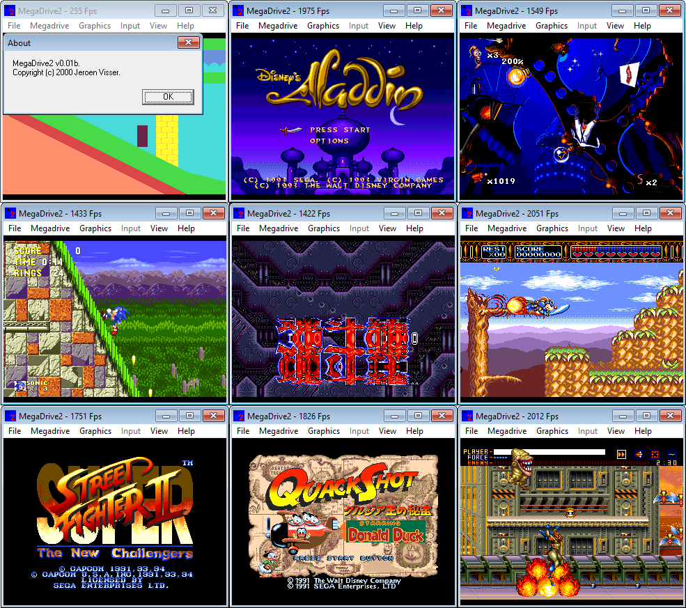
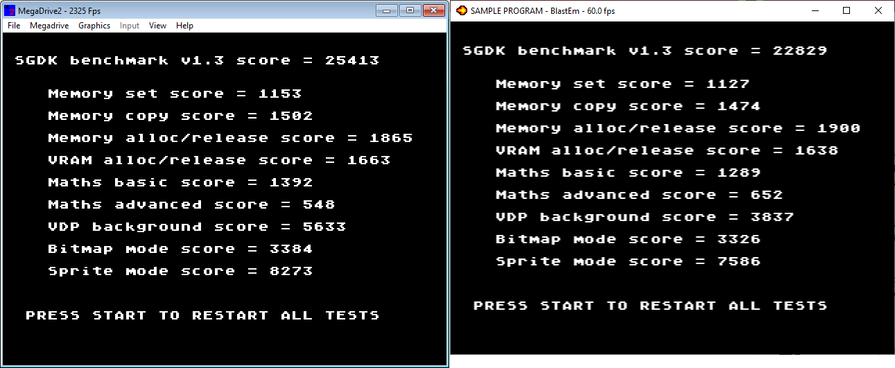

# MegaDrive2

This repository contains the binary file of a [Sega Mega Drive/Genesis](https://en.wikipedia.org/wiki/Sega_Genesis) emulator I had written some 20 years ago as a learning project (unfinished). 
Unfortunately the source code has been lost. Actually even the binary was lost until I recently got a copy from a friend!

# What is implemented
Of the top of my head the following features had been implemented:
- Cycle accurate Motorola 68000 cpu emulator
- VDP emulation + rendering with support for
    - Shadow + Highlight mode
    - Support for raster effects
- 3 button controller support
- SSF mapper support

## Known bugs/missing features
- Hint increment implementation contains an off by one error
- Overlapping shadow/highlight mode
- No Z80 emulation causing many games to hang on 68000<->Z80 communication
  - There is an option in the menu called Z80 fix that toggles a byte in Z80 mem that the Z80 driver as used by many games seem to use for sync/comms. Toggling this option allows some games to boot further.
- No sound chip emulation

# How to run
To run on Windows 10 Windows XP compatibility mode has to be enabled. Fullscreen display does not seem to function though.

# Screenshots
## Games

## [SGDK](https://github.com/Stephane-D/SGDK) benchmark VS [BlastEm](https://www.retrodev.com/blastem/)

